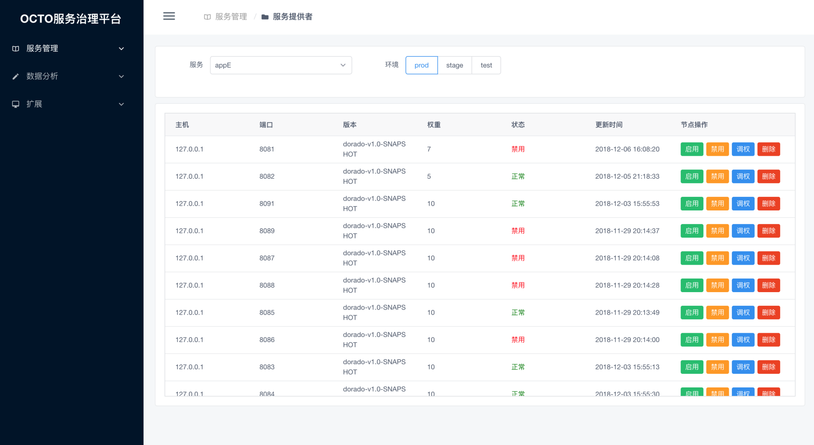

# OCTO-Portal管理端

## 背景描述
OCTO-Portal是美团OCTO服务治理体系的管理端，是为各类服务提供节点操作、配置等功能的管理平台。

## 主页截图



## 主要功能
目前提供的功能有服务节点管理，包括服务节点展现，节点启用禁用、节点权重调整、删除节点等。


## 项目结构

#### 前端部分

* Javascript框架使用[Vue.js](https://vuejs.org)，UI框架使用[iView](https://www.iviewui.com)

#### 后端部分

* 标准Spring Boot工程


## 项目配置启动
* 提供前后端独立部署方式，前端启动端口8081，访问后端8080端口获取数据，前端支持热加载。
* 运行环境: 建议JDK 1.8及以上，建议Node版本>=10.7.0

* 运行前端 octo-portal-frontend
* 首先在octo-portal-frontend/config/index.js 配置后端ip和端口，然后执行以下命令

```bash

cd octo-portal-frontend

npm install

npm run dev 

```

* 运行后端 octo-portal-server
* 首先在src/main/resources/application.yaml中配置注册中心地址，然后执行以下命令

```bash

cd octo-portal-server

mvn clean package -Dmvn.test.skip=true

cd target

java -jar octo-portal-server-0.0.1-SNAPSHOT.jar

```

## Copyright and License
[Apache 2.0 License.](/LICENSE)

## 联系我们
- Mail: inf.octo.os@meituan.com
- [**Issues**](https://github.com/Meituan-Dianping/octo-portal/issues)
